# Packer-Terraform
Clone this repo to your local machine.

## Preparation
### Installation
Check if you already have packer and terraform installed on your machine:
```
% packer
```
If not, run the following commands to install packer:
```
% brew tap hashicorp/tap
% brew install hashicorp/tap/packer
% brew install hashicorp/tap/terraform
``` 
Install Amazon plugin on packer:
```
% packer plugins install github.com/hashicorp/amazon
```

### Configure AWS Credentials
Get your AWS credentials from AWS Academy and export them as environment variables:
```
% export AWS_ACCESS_KEY_ID="your aws_access_key_id"
% export AWS_SECRET_ACCESS_KEY="your aws_secret_access_key"
% export AWS_SESSION_TOKEN="your aws_session_token"
```

## Provision Ubuntu and Amazon Linux EC2s
### Build custom AMIs using Packer
In the root directory of the local repository, create a key pair using Amazon EC2 (You need to have AWS CLI preinstalled):
```
% aws ec2 create-key-pair \
    --key-name ami-key-pair \
    --key-type rsa \
    --key-format pem \
    --query "KeyMaterial" \
    --output text > ami-key-pair.pem
```
You can also name the key pair on your preference. But be sure to change the value on every configuration when this key is involved.

Run the following command to set the permissions of your private key file:
```
% chmod 400 ami-key-pair.pem
```
Note: It is not recommended to change the path of the private key file. If you move it, be sure to update the path in all related files at the same time.

Create two AMIs, one for **Amazon Linux** and another for **Ubuntu** with **docker** and **ssh public key** set up:
```
% cd packer
% packer build aws-ami-docker.json  
```
Once the process is completed, you will see outputs like the following:
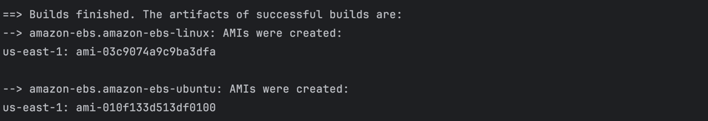

You can also check the built AMIs in AWS Console:
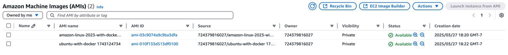


### Provision EC2s and related AWS resources using Terraform
At terraform directory, run the following commands to provision AWS resources
```
$ cd terraform
$ terraform init
$ terraform plan
$ terraform apply
```
After `terraform apply`, you will see output like:
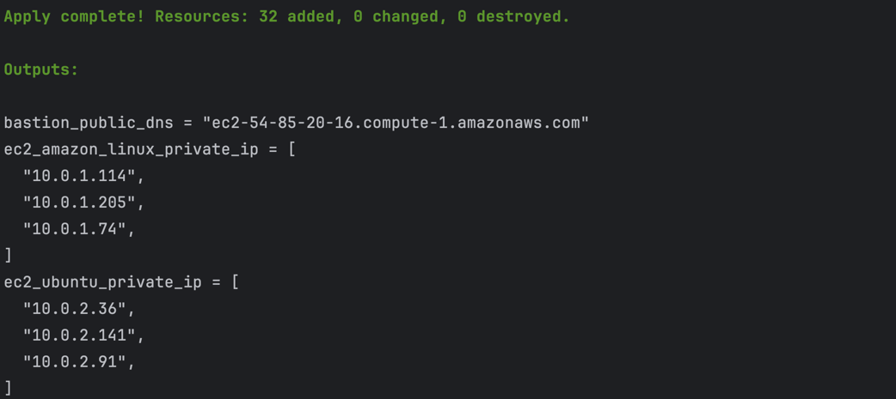

Launched EC2s:
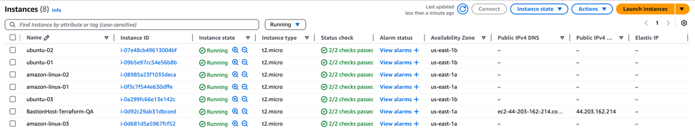

## SSH into Private EC2 via Bastion Host
Add the key in the root directory into SSH agent:
```
% ssh-add ami-key-pair.pem
```
Test by SSH into the bastion host with agent forwarding:
```
% ssh -A -i ami-key-pair.pem ec2-user@[your-bastion-host-public-ipv4-dns]
```
Once you are inside the bastion host, SSH into ec2 instances in the private subnet by
```
% ssh ec2-user@[your-custom-ec2-private-ipv4-dns] // for amazon linux machines
% ssh ubuntu@[your-custom-ec2-private-ipv4-dns] //   for ubuntu machines
```

### Manage Configurations using Ansible
Install ansible on your local machine:
```
% brew update
% brew install ansible
```
Run the following commands to check inventories:
```
% ansible-inventory -i aws_ec2.yml --graph
# Or to get detailed information
# % ansible-inventory -i aws_ec2.yml --list
```
Example output:

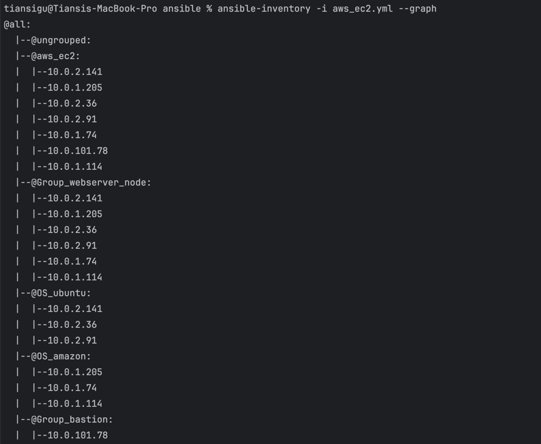

Run the following command to perform update, upgrade, running docker newest version, and report disk usage task:
```
% ansible-playbook -i aws_ec2.yml playbook.yml
```
Output of "Update and upgrade the packages" and "Verify we are running the latest docker" for Ubuntu :
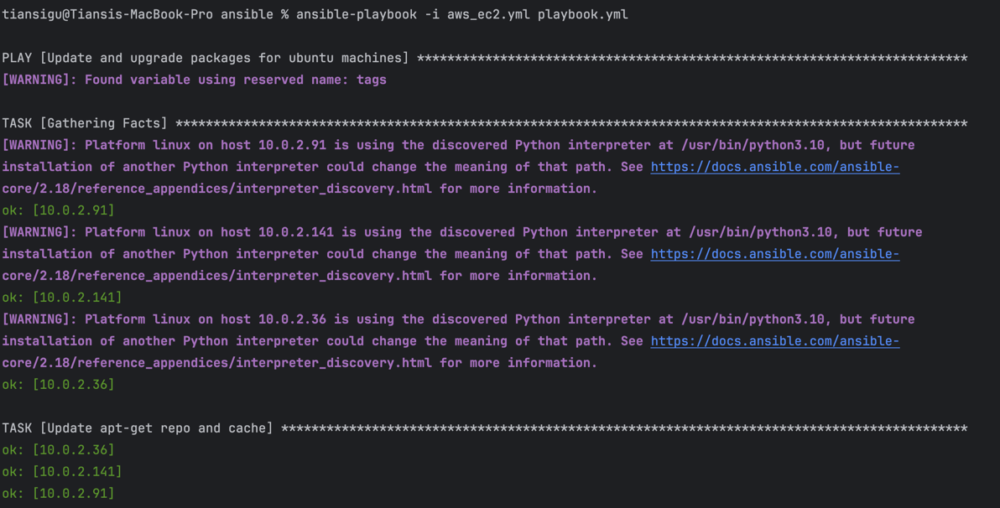
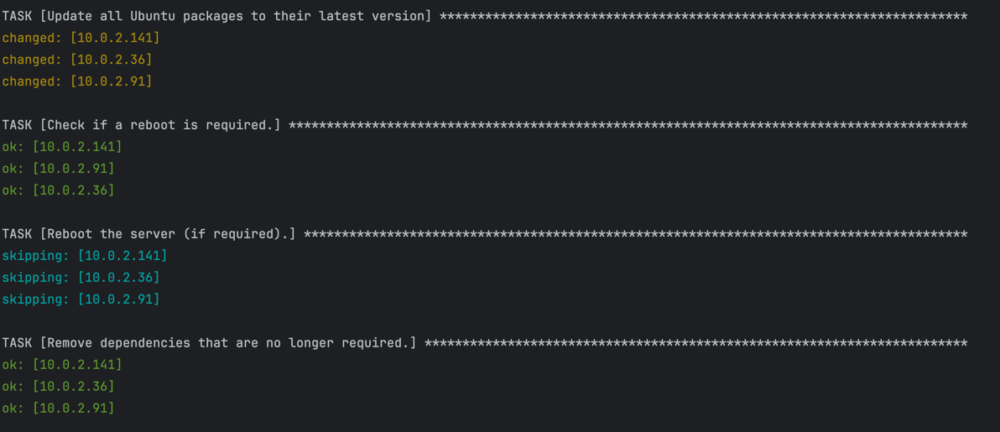
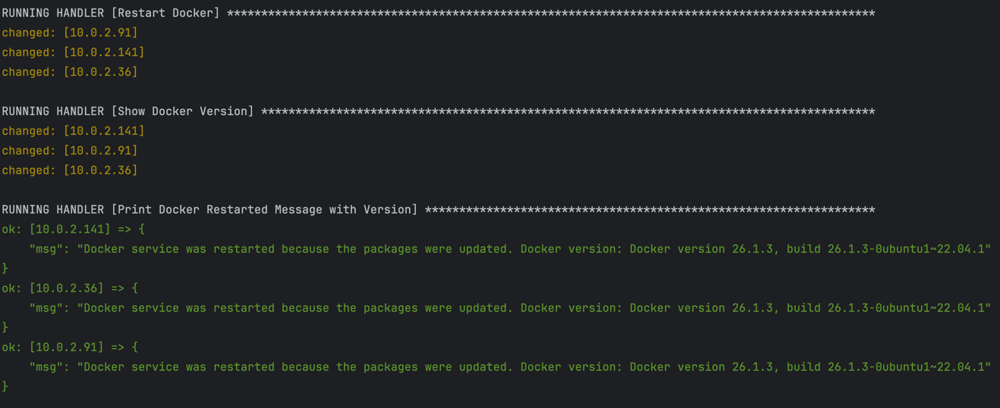

Output of "Update and upgrade the packages" and "Verify we are running the latest docker" for Amazon Linux:
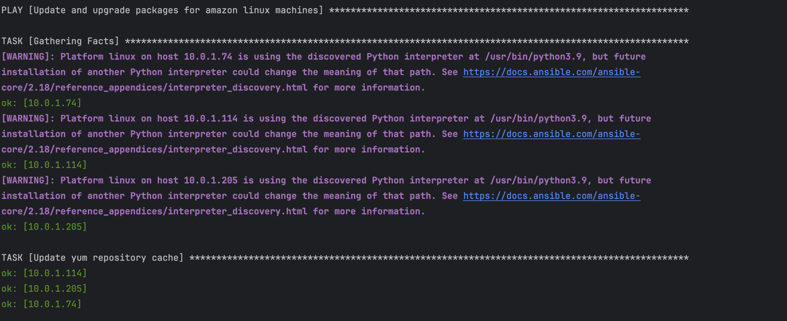
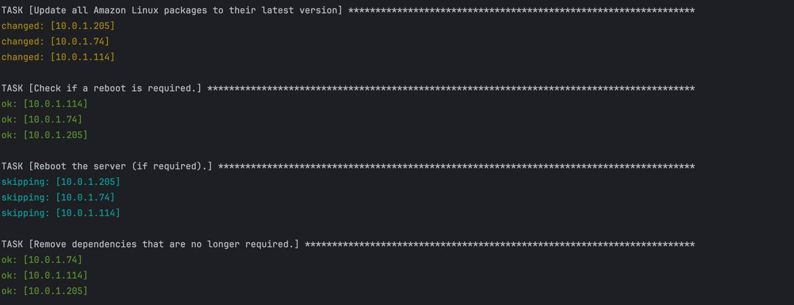
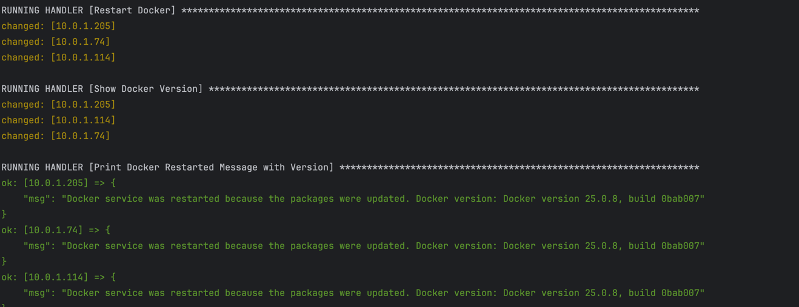

Output of reporting the disk usage for each server node in private subnet:
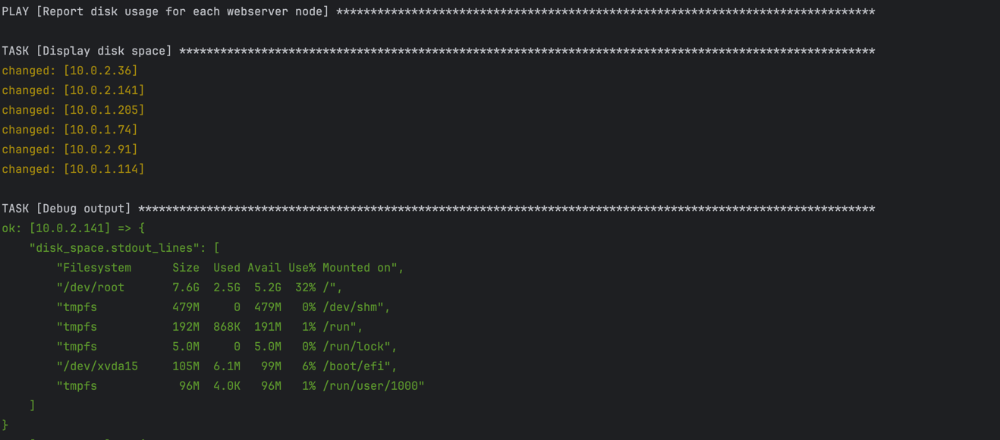
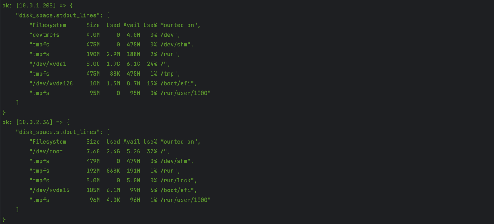
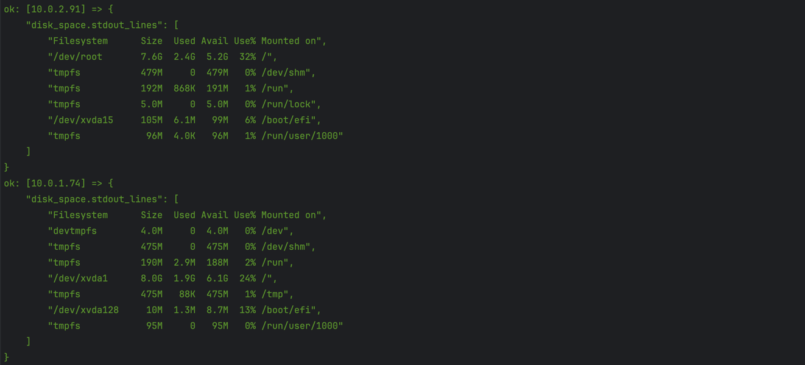
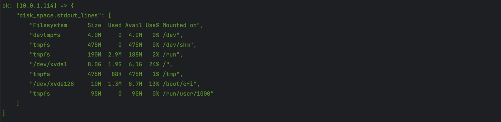

Output of reporting the disk usage for bastion host in public subnet:
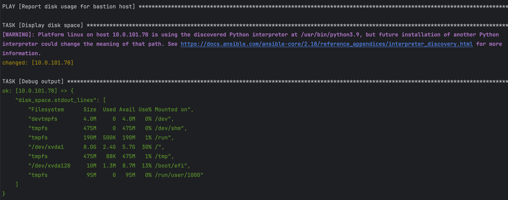

Output of Play Recap:
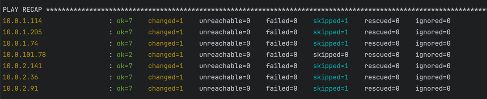


